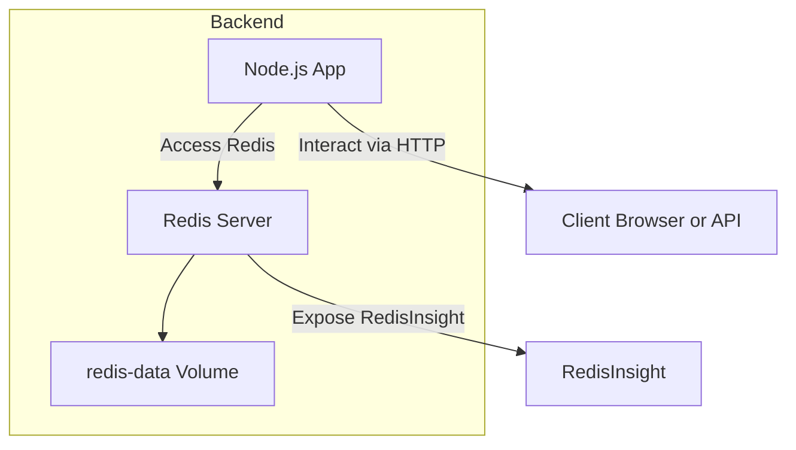
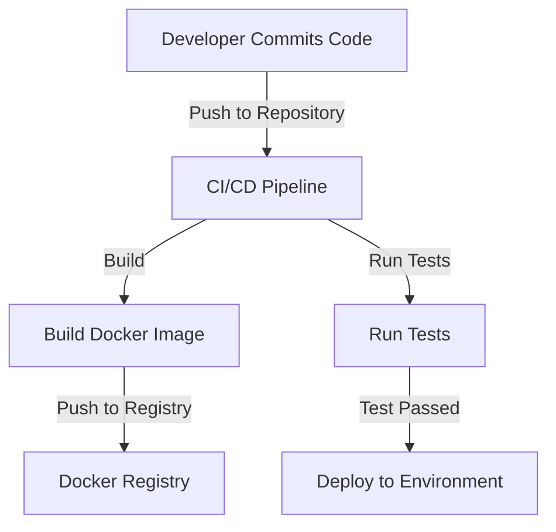
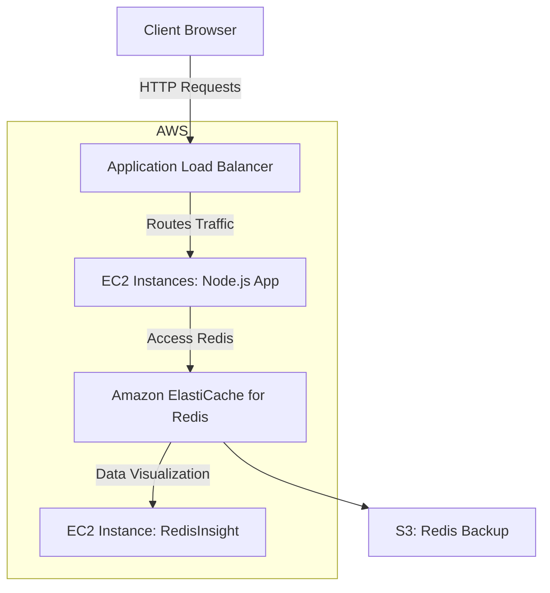
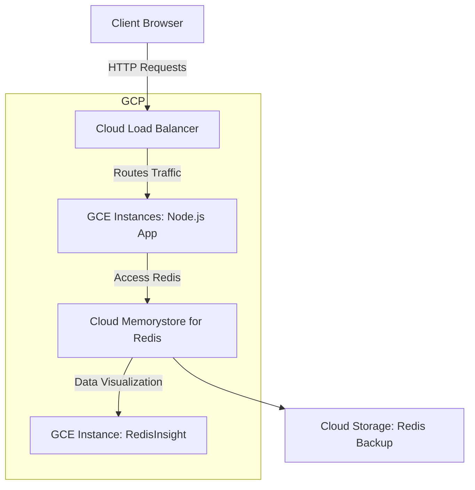
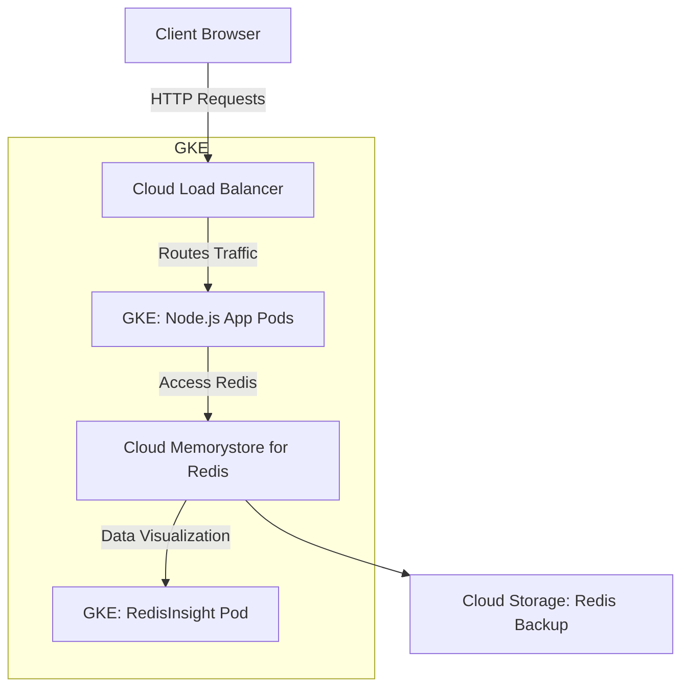

# URL Shortener

A simple URL shortener service built with Node.js and Redis, using Docker for containerization. The service allows users to shorten long URLs and redirect to the original URL using the short URL.

## Table of Contents

- [Project Description](#project-description)
- [Prerequisites](#prerequisites)
- [Installation](#installation)
- [Usage](#usage)
- [Architecture](#architecture)
- [API Endpoints](#api-endpoints)
- [Environment Variables](#environment-variables)
- [CI CD Workflow](#ci-cd-workflow)
- [License](#license)

## Project Description

This URL shortener service provides a simple REST API to create short URLs for long URLs and redirects users to the original URL when the short URL is accessed. The project uses Node.js for the backend, Redis for storage, and Docker for containerization.

## Prerequisites

- [Docker](https://www.docker.com/get-started) and Docker Compose installed on your machine.
- Node.js and npm (for local development).

## Installation

### Clone the repository

```sh
git clone https://github.com/yourusername/url-shortener.git
cd url-shortener 
```

### Setup Environment Variables
Create a .env file in the root directory and add the following variables:
```env
PORT=5000
REDIS_HOST=redis
REDIS_PORT=6379
REDIS_PASSWORD=your_redis_password 
```
### Build and Run with Docker 

```sh 
docker-compose up --build
```
## Usage 

### Shorten URL
```sh 
curl -X POST http://localhost:5000/api/short-urls -H "Content-Type: application/json" -d '{"longUrl": "http://example.com"}'
```

### Redirect to Original URL
Visit `http://localhost:5000/<shortId>` in your browser.


## Architecture



## API Endpoints

### POST /api/short-urls

Create a short URL for a given long URL.

- Request Body: JSON object containing the `longUrl`.
- Response: JSON object containing the `shortUrl` and `longUrl`.

### GET /<shortId>
Redirect to the original URL associated with the `shortId`.

## Environment Variables

| Variable         | Description                     | Default                |
| ---------------- | ------------------------------- | ---------------------- |
| `PORT`           | Port to run the server          | `5000`                 |
| `REDIS_HOST`     | Redis server hostname           | `redis`                |
| `REDIS_PORT`     | Redis server port               | `6379`                 |
| `REDIS_PASSWORD` | Redis server password           | `your_redis_password`  |


## CI CD Workflow



## AWS EC2 Deployment Diagram



## GCP GCE Deployment Diagram



## GKE Deployment



## License

This project is licensed under the MIT License - see the [LICENSE](LICENSE) file for details.

